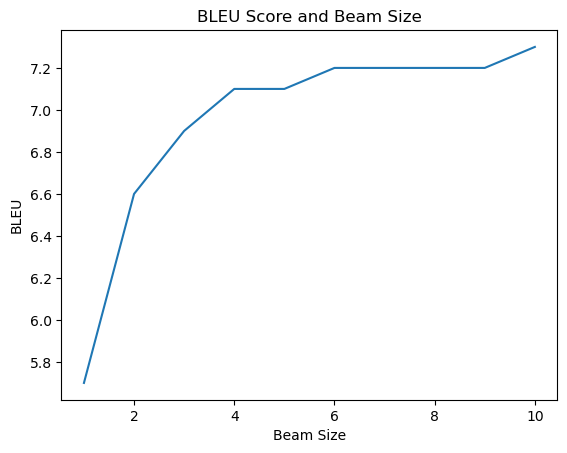
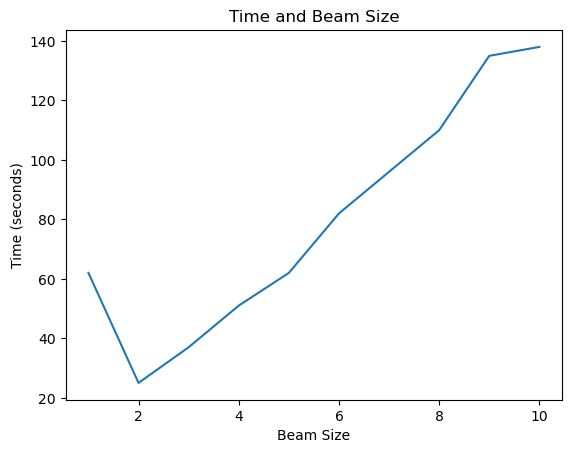

# MT Exercise 5: Byte Pair Encoding, Beam Search
This repository is a starting point for the 5th and final exercise. As before, fork this repo to your own account and the clone it into your prefered directory.

## Requirements

- This only works on a Unix-like system, with bash available.
- Python 3 must be installed on your system, i.e. the command `python3` must be available
- Make sure virtualenv is installed on your system. To install, e.g.

    `pip install virtualenv`

## Steps

Clone your fork of this repository in the desired place:

    git clone https://github.com/[your-name]/mt-exercise-5

Create a new virtualenv that uses Python 3.10. Please make sure to run this command outside of any virtual Python environment:

    ./scripts/make_virtualenv.sh

**Important**: Then activate the env by executing the `source` command that is output by the shell script above.

Download and install required software as described in the exercise pdf.

Download data:

    ./download_iwslt_2017_data.sh
    
Before executing any further steps, you need to make the modifications described in the exercise pdf.

Train a model:

    ./scripts/train.sh

The training process can be interrupted at any time, and the best checkpoint will always be saved.

Evaluate a trained model with 

    ./scripts/evaluate.sh

## Models
1. word_level_transformer
2. bpe_level_transformer
3. bpe_level_transformer2

## Experiments of BPE
I choose the translation direction from Italian to English. I build, train, and evaluate the model as following steps:
1.  Sub-sample the training data to 100K sentences
2.  Use JoeyNMT to train the word level model, setting the vocabulary size=2000
3.  Generate BPE vocabulary with the size of 2K and 3K respectively
4.  Use JoeyNMT to train 2 BPE level model respectively
5.  Evaluate the BLEU score of these three models as follows:

|     | use_BPE | vol_size | BLEU |
|-----|---------|----------|------|
| (a) | no      | 2000     | 7.1  |
| (b) | yes     | 2000     | 6.5  |
| (c) | yes     | 3000     | 4.9  |
 

I obtained a highly counterintuitive result in this study, primarily attributed to the limited training steps I employed due to time constraints. Nonetheless, upon examining the validations.txt file of the three models, I observed acc(word)>acc(bpe_2000)>acc(bpe_3000). It remains uncertain whether this divergence arises from the requirement for additional convergence steps in the BPE model or the inadequacy of the trained bpe vocabulary. Further investigation is required to address this matter comprehensively.

## Beam Search
The word-level model trained in the previous task was selected due to its superior BLEU score. I set the beam size from 1 to 10 and perform the translation on test data 10 times and generate two line charts, depicting the correlation between beam size and both the BLEU score and the time required to generate translations.

The graphs reveal a clear correlation between beam size and BLEU score, indicating that larger beam sizes tend to yield higher BLEU scores. However, it is noteworthy that the increase in score becomes marginal once the beam size surpasses 4. Additionally, the time required for translation generation exhibits a positive linear relationship with beam size. Notably, when utilizing a beam size of 1, a relatively longer processing time is observed, potentially due to the absence of cached information in memory during the initial round of translation.
